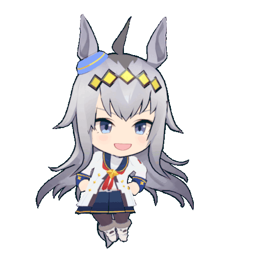
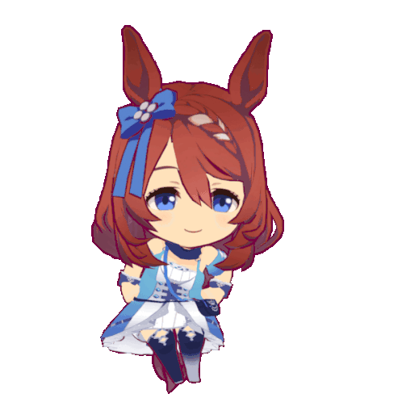
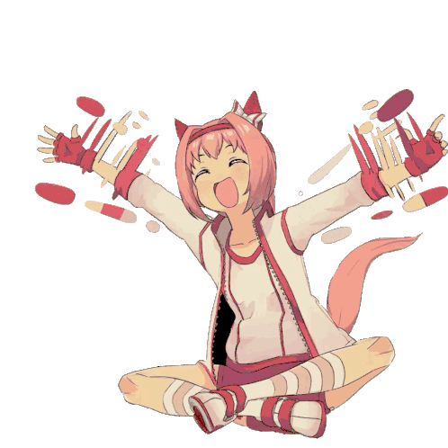

# Uma-Solana

<p align="center">
  
  
</p>

A text-based game inspired by **Umamusume Pretty Derby**, built in Rust. Train your Uma, manage her energy and mood, and compete in races. Lose too many times and she might retire for good.

The project has two versions: a **local CLI** and an **on-chain Solana program** built with Anchor.

---

## Gameplay

Each run starts by naming your Uma (leave it blank for a random name). From that point, turns count down to race day. On each turn you choose one action:

| Action | Effect |
|---|---|
| **Train Speed** | Increases speed stat |
| **Train Stamina** | Increases stamina stat |
| **Train Power** | Increases power stat |
| **Train Guts** | Increases guts stat |
| **Train Wit** | Increases wit stat |
| **Rest** | Recovers energy |
| **Recreation** | Improves mood |

When the countdown reaches zero it's race day. After the race, win or lose, a new countdown begins for the next one.

---

## Stats

Each stat is rated from **G** up to **SS+** and affects different parts of a race.

| Stat | Role |
|---|---|
| **Speed** | Core performance in the mid and late stages of the race |
| **Stamina** | Prevents a penalty on longer distances |
| **Power** | Early race burst and surface efficiency |
| **Guts** | Reduces the stamina penalty when stamina is too low |
| **Wit** | Multiplies the effectiveness of your running style |

Training has a **failure chance** that increases as the stat grows higher or when energy is low. A failed training session still costs a turn.

---

## Aptitudes

Each Uma is born with hidden aptitude grades for track, distance, and running style. These act as multipliers on the corresponding stats during race scoring and are revealed progressively.

**Track**
- Turf
- Dirt

**Distance**
- Sprint (1000–1400 m)
- Mile (1600–1800 m)
- Medium (2000–2400 m)
- Long (2500–3600 m)

**Running Style**
- Front — strong early, fades late
- Pace — balanced with a mid-race emphasis
- Late — builds up through the race
- End — explosive final stretch

---

## Energy & Mood

**Energy** (0–100) affects training failure chance. Low energy makes training riskier. Use **Rest** to recover it.

**Mood** has five levels and applies a bonus or penalty to race performance:

| Mood | Symbol | Race modifier |
|---|---|---|
| Great | `(^)` | +bonus |
| Good | `(/)` | +small bonus |
| Normal | `(-)` | neutral |
| Bad | `(\)` | -small penalty |
| Awful | `(v)` | -penalty |

Use **Recreation** to improve mood by one level.

---

## Races

On race day your Uma competes against a field of bot runners on a randomly generated racecourse (random surface, random distance). Early races use weaker bots to give you room to grow; the field becomes more competitive over time.

**Race score** is calculated from weighted phases:

- **Early phase** — Power + Wit
- **Mid phase** — Speed + Wit
- **Late phase** — Speed + Power

Stamina determines whether you can sustain peak performance. Guts softens the blow when stamina falls short.

### After the race

- **Win** — a new countdown of 8–14 turns begins.
- **Loss** — there is a chance of **retirement** that increases with each failed race (10% → 20% → 30% → 40% → 50%+). If she survives, training resumes with a shorter countdown.

---

## Project Structure

```
Uma-Solana/
├── src/               # Solana on-chain program (Anchor)
│   ├── lib.rs         # Program entry points (create_uma, train, rest, recreation, race)
│   ├── uma.rs         # Uma struct, stats, mood, energy, training and race logic
│   ├── race.rs        # Race orchestration and scoring
│   ├── racecourse.rs  # Random track and distance generation
│   ├── bot.rs         # Bot AI trainer and style picker
│   └── random.rs      # On-chain randomness utilities
└── uma/               # Local CLI version (Rust binary)
    └── src/
        ├── main.rs
        ├── classes/   # Uma, Race, Racecourse, Bot
        └── utils/     # Terminal drawer, keyboard input, random helpers
```

---

## Running Locally

```bash
cd uma
cargo run
```

Requires Rust (edition 2024).

## Deploying to Solana

The on-chain program is built with [Anchor](https://www.anchor-lang.com/). Deploy it to devnet and interact with it via the `client/client.ts` script or any Anchor-compatible client.

```bash
anchor build
anchor deploy
```

Program ID: `72PwRxpFvGCHWq6LXE5rHo7hRDcgRKNbcPd5FMxinWjp`

Available instructions: `create_uma` · `train` · `rest` · `recreation` · `race`

For best experience play [Umamusume Pretty Derby](https://umamusume.com)

<p align="center">
  
</p>
